# Elite Senior Frontend Interview Practice Bank

Welcome to your definitive, self-contained offline repository for senior frontend interview preparation. This practice bank is structured to simulate LeetCode-style workflow, systems design depth, and browser core-engine mechanics.

---

## 📖 Preparation Methodology

This repository is built on **Active Recall** and **Space Repetition**. Reading theory is passive; to pass L6/L7 interviews, you must analyze tradeoffs, write bug-free code under time constraints, and structure your verbal arguments.

Every topic is split into three files:
1. **Theory (`theory/`)**: Focuses on "why it matters," browser/react engines, and the crucial distinction between Junior and Senior responses.
2. **Quiz (`quiz/`)**: Tests execution-context edge cases, type coercion, layout loops, and rendering loops.
3. **Practical (`practical/`)**: Real-world coding, refactoring, and debugging challenges with time/space complexities and senior tradeoffs.

---

## ⏱️ Daily 45-Minute Practice Routine

To make consistent progress, commit to one module per day using this split:

```mermaid
gantt
    title Daily 45-Minute Routine
    dateFormat  X
    axisFormat %s
    section Study
    Read Theory (10m)      :active, 0, 10
    section Active Recall
    Complete Quiz (15m)    :crit, 10, 25
    section Hands-on
    Code/Debug Practical (20m) : 25, 45
```



- **Minutes 00–10 (Theory)**: Focus on the "Junior vs. Senior View" and "Under-the-Hood V8/Browser Mechanics." Do not just read syntax—focus on why decisions are made.
- **Minutes 10–25 (Quiz)**: Solve the questions *without* looking at the answer key. Write down your thought process and step-by-step evaluation of outputs.
- **Minutes 25–45 (Practical)**: Implement the solution in the starter code. Pay attention to runtime/space complexities, memory leaks, and edge cases.

---

## 📈 Tracking Progress & Revision

Use [progress-tracker.md](file:///mnt/New_Volume/samta/coupa-interview-preparation/frontend-interview-practice/progress-tracker.md) to record your scores and confidence levels (1-5).
- **Confidence 1-2**: Revisit in 3 days.
- **Confidence 3-4**: Revisit in 7 days.
- **Confidence 5**: Revisit in 21 days.

### How to Revise Weak Areas
When revisiting a topic:
1. Open the **Practical** file and refactor the code to optimize for memory or a new constraint.
2. Review the **Common Interview Traps** in the Theory file.
3. Verbally answer the **Interviewer Follow-ups** out loud.

---

## 🎭 How to Simulate Mock Interviews

To transition from "technically correct" to "senior-level communicator":
1. **Think Out Loud**: When solving quizzes and practicals, record yourself speaking. Explain *why* you are choosing a specific data structure or design pattern.
2. **Clarifying Questions First**: Never start coding immediately in a practical. Write down 3-4 clarifying questions you would ask an interviewer (e.g., scale, constraints, support).
3. **Behavioral Integration**: Read [interview-story-bank.md](file:///mnt/New_Volume/samta/coupa-interview-preparation/frontend-interview-practice/interview-story-bank.md) and prepare at least two distinct stories for each prompt using the STAR + Technical Depth format.

---

## 🗺️ Recommended Prep Order

For maximum efficiency, follow this syllabus path:

```
[1. JavaScript Core Engines] ➔ [2. Browser Pipeline] ➔ [3. CSS Mechanics]
            │
            ▼
[4. React Core & State] ➔ [5. System Design & Scaling] ➔ [6. Performance & Testing]
            │
            ▼
[7. Debugging Simulation] ➔ [8. Senior Coaching & Story Bank]
```

1. **JavaScript Engine & Async**: Lock down Closures, Prototypes, Event Loop, and Memory Management.
2. **Browser & CSS**: Master the Critical Rendering Path, Layouts, Specifity, and DOM/BOM architecture.
3. **React & Next.js**: Understand Reconciler Fiber loop, Custom hooks stale closures, Server Components, and State architecture.
4. **System Design**: Practice Virtualization, Dashboard syncing, Component Libraries, and Monorepos.
5. **Performance & Diagnostics**: Dive into Core Web Vitals, Bundle optimization, and Chrome DevTools profiling.
6. **Testing & Debugging**: Write resilient RTL/MSW tests and debug complex loops.
7. **Coaching & Stories**: Polish behavioral stories, tradeoff discussions, and leadership presentation.
