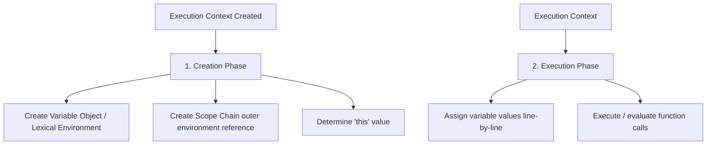

# PART 1: ADVANCED JAVASCRIPT & TYPESCRIPT ENGINE MECHANICS

## Module 1.1: The V8 Engine, Memory Management, and Garbage Collection

### 1. Execution Context, Call Stack, and Heap
In JavaScript, all code executes inside an **Execution Context**. The execution context is an abstract concept that holds the environment in which the current code is being evaluated and executed. 

There are three primary types of execution contexts:
1. **Global Execution Context (GEC):** Created by default when the engine starts. It creates the global object (`window` in browsers, `global` in Node.js) and sets the `this` binding to it.
2. **Function Execution Context (FEC):** Created every time a function is invoked. Each function has its own execution context, created dynamically on call.
3. **Eval Execution Context:** Created when code is executed inside an `eval()` function (discouraged in production environments due to optimization blocks).

#### The Lifecycle of an Execution Context
An execution context is processed in two distinct phases:



##### 1. Creation Phase
Before any JavaScript code is executed, the engine runs the creation phase:
- **Lexical Environment Creation:** The engine stores variables declared with `let` and `const`, as well as function declarations. They are initialized as `<uninitialized>` (leading to the Temporal Dead Zone).
- **Variable Environment Creation:** The engine stores variables declared with `var`. They are initialized to `undefined` (hoisting).
- **Outer Environment Reference (`Scope` Link):** Each context holds a reference to its outer lexical environment, forming the scope chain.
- **`this` Binding:** The value of `this` is dynamically evaluated based on how the function is called.

##### 2. Execution Phase
The engine executes the code line-by-line, assigns values to variables, and executes function invocations.

---

### 2. Call Stack vs. Heap Allocation
Memory in V8 is divided into two primary structures: the **Call Stack** and the **Heap**.

| Characteristic | Call Stack | Memory Heap |
| :--- | :--- | :--- |
| **Data Types Stored** | Primitive values (`number`, `string`, `boolean`, `null`, `undefined`, `symbol`, `bigint`) and stack frames containing references/pointers to the heap. | Reference types (Objects, Arrays, Functions, Closures). |
| **Size & Structure** | LIFO (Last In, First Out). Fixed size per frame. Fast allocation/deallocation. | Unstructured, dynamic size. Slower allocation/deallocation. |
| **Management** | Managed automatically by the CPU thread. Memory is reclaimed when stack frame pops. | Managed by the Garbage Collector (GC) using complex algorithms. |

#### V8 Stack Frame Mechanics
When a function is called, V8 pushes a new **Stack Frame** onto the Call Stack. This frame contains:
- **Parameters:** Arguments passed to the function.
- **Local Variables:** Primitives defined inside the function.
- **Return Address:** Where the thread execution should jump back to after the function returns.
- **Pointer References:** Memory addresses pointing to the actual heap locations where objects are allocated.

```
Call Stack                                 Memory Heap
+----------------------------+             +---------------------------+
| Frame: processData()       |             | { id: 101,                |
| - localRef: 0x7ffd98 ----+ |             |   name: "Enterprise" }    |
+--------------------------| |             |   (Allocated at 0x7ffd98) |
| Frame: main()            | |             +---------------------------+
| - dataRef: 0x7ffd98 -----|-+             | [ 1, 2, 3, 4, 5 ]         |
+--------------------------|               |   (Allocated at 0x8ffa12) |
                           +-------------> +---------------------------+
```

---

### 3. Closures at the Byte-Code Level
A **Closure** is the combination of a function bundled together (enclosed) with references to its surrounding state (the **lexical environment**). 

#### Under the Hood: Heap-Allocated Contexts
To understand closures at the byte-code level, we must look at how V8 compiles code. Normally, when a function returns, its stack frame is popped, and its local variables are destroyed. However, if an inner function references any variables from the outer function, V8's **Scope Analysis** phase (during parsing) detects this.

1. **Context Allocation:** Instead of allocating the enclosed variables on the Stack, V8 allocates a special internal object called a **Context** (specifically, a `FunctionContext` or `ClosureContext`) on the **Heap**.
2. **Bytecode Instruction:** The outer function's bytecode contains instruction sets like `CreateFunctionContext` and `PushContext`.
3. **Variable Access:** Any access to the enclosed variables inside either the outer or inner function is compiled into bytecode instructions like `LdaContextSlot` (Load Accumulator from Context Slot) and `StaContextSlot` (Store Accumulator to Context Slot), rather than stack offset instructions like `Ldar` (Load Register).
4. **ScopeInfo:** V8 attaches a `ScopeInfo` object to the closure function object. The closure function maintains an internal `[[Scopes]]` property containing a chain of references to these heap-allocated context objects.

Because the inner function retains a reference to this heap-allocated context via its `[[Scopes]]` array, the context cannot be garbage collected as long as the inner function is reachable.

---

### 4. Identifying and Fixing Memory Leaks in Production
A memory leak occurs when memory is allocated on the heap but is no longer needed by the application, yet the garbage collector cannot reclaim it because it is still reachable from the GC Root (usually the global object, active stack frames, or DOM tree).

#### Common Leak Patterns & Architectural Solutions

##### A. Accidental Globals
If variables are assigned without declaration (`var`, `let`, or `const`), they attach to the global object.
```typescript
// LEAKY
function initializeCache() {
  // 'cache' is created as a property on globalThis / window
  cache = new Array(1000000).fill("leak");
}

// SECURE FIX
function initializeCacheSecure() {
  "use strict"; // Prevents accidental globals by throwing a ReferenceError
  const cache: string[] = new Array(1000000).fill("leak");
}
```

##### B. Forgotten Timers and Event Listeners
A setInterval or event listener referencing an object prevents that object from being garbage collected.
```typescript
// LEAKY
class DataPresenter {
  private data: string[] = new Array(50000).fill("data");

  public startPolling() {
    setInterval(function() {
      // Keeps the outer 'this' context and its 'data' array alive indefinitely
      console.log("Polling data count: ", this.data.length);
    }.bind(this), 1000);
  }
}

// SECURE FIX
class ResilientDataPresenter {
  private data: string[] = new Array(50000).fill("data");
  private timerId: NodeJS.Timeout | null = null;

  public startPolling() {
    this.timerId = setInterval(() => {
      console.log("Polling data count: ", this.data.length);
    }, 1000);
  }

  public destroy() {
    if (this.timerId) {
      clearInterval(this.timerId);
      this.timerId = null;
    }
  }
}
```

##### C. Detached DOM Nodes
A detached DOM node occurs when an element is removed from the DOM tree, but a JavaScript reference to that element still exists.
```typescript
// LEAKY
let detachedElement: HTMLElement | null = null;

function createAndLeakElement() {
  const btn = document.createElement("button");
  btn.id = "leak-btn";
  document.body.appendChild(btn);
  
  // Retaining reference in JS global variable
  detachedElement = btn;
  
  // Remove from DOM
  document.body.removeChild(btn);
  // 'btn' is detached, but cannot be GC'd because 'detachedElement' points to it.
}

// SECURE FIX
function createAndCleanupElement() {
  const btn = document.createElement("button");
  btn.id = "safe-btn";
  document.body.appendChild(btn);
  
  // Perform operations...
  
  document.body.removeChild(btn);
  // Keep local scoped, let it naturally fall out of scope when function ends
}
```

##### D. Weak References for Caches
Standard `Map` and `Set` hold strong references to their keys and values. If an object is used as a key in a standard `Map`, it will never be garbage collected, even if all other references to it are deleted.
```typescript
// LEAKY
const userMetadataCache = new Map<object, { lastActive: number }>();

function cacheUserMetadata(user: object) {
  userMetadataCache.set(user, { lastActive: Date.now() });
} // If 'user' object is deleted elsewhere, it remains stuck in userMetadataCache.

// SECURE FIX
const weakUserMetadataCache = new WeakMap<object, { lastActive: number }>();

function cacheUserMetadataSafe(user: object) {
  weakUserMetadataCache.set(user, { lastActive: Date.now() });
} // When 'user' is no longer referenced anywhere else, it is safely collected.
```

---

## Module 1.2: Asynchronous Architecture & Event Loop

### 1. Macro-tasks vs. Micro-tasks Execution Order
The JavaScript runtime runs on a single-threaded loop known as the **Event Loop**. It orchestrates the execution of multiple tasks, callbacks, and rendering steps.

```
       +---------------------------------------------+
       |             Call Stack Execution            |
       +----------------------|----------------------+
                              | (Stack Empty)
                              v
       +---------------------------------------------+
       |           Process ALL Microtasks            |
       |       (Promise callbacks, MutationObs)      |
       +----------------------|----------------------+
                              |
                              v
       +---------------------------------------------+
       |         Check Animation / Rendering         |
       |        (requestAnimationFrame, Paint)       |
       +----------------------|----------------------+
                              |
                              v
       +---------------------------------------------+
       |            Process ONE Macrotask            |
       |        (setTimeout, setInterval, I/O)       |
       +---------------------------------------------+
```

The runtime divides tasks into two queues:
1. **Micro-task Queue:** Contains high-priority tasks that must be executed immediately after the current script execution stack yields, before control is handed back to the event loop or rendering pipelines.
   - Examples: `Promise.then`, `queueMicrotask`, `MutationObserver`, `process.nextTick` (Node.js specific, runs before standard microtasks).
2. **Macro-task Queue (Task Queue):** Contains standard asynchronous tasks. The event loop pulls only *one* macro-task from the queue per tick.
   - Examples: `setTimeout`, `setInterval`, `setImmediate` (Node.js), `requestAnimationFrame` (executes during rendering path, distinct but macro-like), UI events, I/O.

#### The Rendering Boundary
Browser layouts, paints, and composite stages occur inside the rendering boundary. The browser attempts to sync these rendering steps with the screen refresh rate (usually 60Hz or 120Hz). Rendering only happens *after* the Micro-task Queue is completely flushed, and before the next Macro-task begins. If the Micro-task Queue contains an infinite recursive chain of microtasks, the Event Loop is blocked, freezing the main thread and preventing UI updates.

---

### 2. A+ Conforming Promise Implementation from Scratch
To deeply understand how the Promise resolution procedure works, here is a complete, production-grade implementation conforming to the Promises/A+ specification.

```typescript
type State = "pending" | "fulfilled" | "rejected";
type Executor<T> = (
  resolve: (value: T | PromiseLike<T>) => void,
  reject: (reason: any) => void
) => void;

interface PromiseLike<T> {
  then<TResult1 = T, TResult2 = never>(
    onfulfilled?: ((value: T) => TResult1 | PromiseLike<TResult1>) | undefined | null,
    onrejected?: ((reason: any) => TResult2 | PromiseLike<TResult2>) | undefined | null
  ): PromiseLike<TResult1 | TResult2>;
}

export class CustomPromise<T> implements PromiseLike<T> {
  private state: State = "pending";
  private value: any = undefined;
  private reason: any = undefined;
  private onFulfilledCallbacks: Array<() => void> = [];
  private onRejectedCallbacks: Array<() => void> = [];

  constructor(executor: Executor<T>) {
    try {
      executor(this.resolve.bind(this), this.reject.bind(this));
    } catch (error) {
      this.reject(error);
    }
  }

  private resolve(value: T | PromiseLike<T>): void {
    if (value === this) {
      throw new TypeError("Chaining cycle detected for promise");
    }

    if (this.state !== "pending") return;

    // Handle nested PromiseLike (thenables)
    if (value !== null && (typeof value === "object" || typeof value === "function")) {
      let then: any;
      try {
        then = (value as PromiseLike<T>).then;
      } catch (error) {
        this.reject(error);
        return;
      }

      if (typeof then === "function") {
        let called = false;
        try {
          then.call(
            value,
            (y: any) => {
              if (called) return;
              called = true;
              this.resolve(y);
            },
            (r: any) => {
              if (called) return;
              called = true;
              this.reject(r);
            }
          );
        } catch (error) {
          if (!called) {
            this.reject(error);
          }
        }
        return;
      }
    }

    this.state = "fulfilled";
    this.value = value;
    this.executeMicrotasks(this.onFulfilledCallbacks);
  }

  private reject(reason: any): void {
    if (this.state !== "pending") return;

    this.state = "rejected";
    this.reason = reason;
    this.executeMicrotasks(this.onRejectedCallbacks);
  }

  private executeMicrotasks(callbacks: Array<() => void>): void {
    queueMicrotask(() => {
      while (callbacks.length > 0) {
        const callback = callbacks.shift();
        if (callback) {
          try {
            callback();
          } catch (error) {
            console.error(error);
          }
        }
      }
    });
  }

  public then<TResult1 = T, TResult2 = never>(
    onfulfilled?: ((value: T) => TResult1 | PromiseLike<TResult1>) | undefined | null,
    onrejected?: ((reason: any) => TResult2 | PromiseLike<TResult2>) | undefined | null
  ): CustomPromise<TResult1 | TResult2> {
    
    const realOnFulfilled = typeof onfulfilled === "function" ? onfulfilled : (v: T) => v as any;
    const realOnRejected = typeof onrejected === "function" ? onrejected : (r: any) => { throw r; };

    const promise2 = new CustomPromise<TResult1 | TResult2>((resolve, reject) => {
      const handleFulfilled = () => {
        queueMicrotask(() => {
          try {
            const x = realOnFulfilled(this.value);
            resolvePromise(promise2, x, resolve, reject);
          } catch (error) {
            reject(error);
          }
        });
      };

      const handleRejected = () => {
        queueMicrotask(() => {
          try {
            const x = realOnRejected(this.reason);
            resolvePromise(promise2, x, resolve, reject);
          } catch (error) {
            reject(error);
          }
        });
      };

      if (this.state === "fulfilled") {
        handleFulfilled();
      } else if (this.state === "rejected") {
        handleRejected();
      } else {
        this.onFulfilledCallbacks.push(handleFulfilled);
        this.onRejectedCallbacks.push(handleRejected);
      }
    });

    return promise2;
  }

  public catch<TResult = never>(
    onrejected?: ((reason: any) => TResult | PromiseLike<TResult>) | undefined | null
  ): CustomPromise<T | TResult> {
    return this.then(null, onrejected);
  }

  public static resolve<U>(value: U | PromiseLike<U>): CustomPromise<U> {
    if (value instanceof CustomPromise) {
      return value;
    }
    return new CustomPromise<U>((resolve) => resolve(value));
  }

  public static reject<U>(reason: any): CustomPromise<U> {
    return new CustomPromise<U>((_, reject) => reject(reason));
  }
}

function resolvePromise<U>(
  promise2: CustomPromise<U>,
  x: any,
  resolve: (value: any) => void,
  reject: (reason: any) => void
): void {
  if (promise2 === x) {
    reject(new TypeError("Chaining cycle detected: Promise cannot resolve to itself"));
    return;
  }

  if (x instanceof CustomPromise) {
    x.then(
      (y) => resolvePromise(promise2, y, resolve, reject),
      (r) => reject(r)
    );
    return;
  }

  if (x !== null && (typeof x === "object" || typeof x === "function")) {
    let then: any;
    let called = false;
    try {
      then = x.then;
      if (typeof then === "function") {
        then.call(
          x,
          (y: any) => {
            if (called) return;
            called = true;
            resolvePromise(promise2, y, resolve, reject);
          },
          (r: any) => {
            if (called) return;
            called = true;
            reject(r);
          }
        );
      } else {
        resolve(x);
      }
    } catch (error) {
      if (!called) {
        reject(error);
      }
    }
  } else {
    resolve(x);
  }
}
```

---

### 3. Handling Unhandled Rejections Globally
When a promise rejects, but there is no catch handler, it propagates up to the runtime process level. Production apps must register global listeners to catch and report these errors.

```typescript
// Browser Environment
window.addEventListener("unhandledrejection", (event: PromiseRejectionEvent) => {
  event.preventDefault();
  console.warn("Global Catch - Unhandled Promise Rejection:", {
    promise: event.promise,
    reason: event.reason,
  });
});

// Node.js Environment
process.on("unhandledRejection", (reason: any, promise: Promise<any>) => {
  console.error("Critical Node - Unhandled Promise Rejection:", {
    promise,
    reason,
  });
});
```

---

### 4. Concurrent Request Pool Manager
Below is a highly optimized, stateful Promise Pool Manager for concurrent network tracking.

```typescript
interface RequestPoolOptions {
  concurrency: number;
  retries?: number;
  rateLimitMs?: number;
}

type TaskProducer<T> = () => Promise<T>;

export class PromisePool {
  private concurrency: number;
  private retries: number;
  private rateLimitMs: number;
  private running = 0;
  private queue: Array<{
    producer: TaskProducer<any>;
    resolve: (val: any) => void;
    reject: (err: any) => void;
    retryCount: number;
  }> = [];

  constructor(options: RequestPoolOptions) {
    this.concurrency = Math.max(1, options.concurrency);
    this.retries = options.retries ?? 3;
    this.rateLimitMs = options.rateLimitMs ?? 0;
  }

  public async run<T>(tasks: Array<TaskProducer<T>>): Promise<T[]> {
    const results: T[] = new Array(tasks.length);
    let completedCount = 0;
    
    return new Promise<T[]>((resolve, reject) => {
      if (tasks.length === 0) {
        resolve([]);
        return;
      }

      const executeNext = async () => {
        if (this.queue.length === 0 && this.running === 0) {
          resolve(results);
          return;
        }

        while (this.running < this.concurrency && this.queue.length > 0) {
          const item = this.queue.shift();
          if (!item) continue;

          this.running++;
          
          if (this.rateLimitMs > 0) {
            await new Promise((r) => setTimeout(r, this.rateLimitMs));
          }

          const index = tasks.indexOf(item.producer as any);

          this.executeTask(item.producer, item.retryCount)
            .then((result) => {
              this.running--;
              results[index] = result;
              completedCount++;
              
              if (completedCount === tasks.length) {
                resolve(results);
              } else {
                executeNext();
              }
            })
            .catch((error) => {
              if (item.retryCount < this.retries) {
                this.running--;
                this.queue.push({
                  producer: item.producer,
                  resolve: item.resolve,
                  reject: item.reject,
                  retryCount: item.retryCount + 1,
                });
                executeNext();
              } else {
                this.running--;
                reject(new Error(`Task failed after ${this.retries} retries. Reason: ${error.message}`));
              }
            });
        }
      };

      tasks.forEach((task) => {
        this.queue.push({
          producer: task,
          resolve: () => {},
          reject: () => {},
          retryCount: 0,
        });
      });

      executeNext();
    });
  }

  private async executeTask<T>(producer: TaskProducer<T>, attempt: number): Promise<T> {
    try {
      return await producer();
    } catch (error) {
      if (attempt < this.retries) {
        const delay = Math.pow(2, attempt) * 100 + Math.random() * 50;
        await new Promise((resolve) => setTimeout(resolve, delay));
      }
      throw error;
    }
  }
}
```

---

## Module 1.3: Advanced TypeScript

### 1. Advanced Conditional and Distributive Types
Conditional types select one of two possible types based on a relationship checked by a extends condition.

```typescript
type IsString<T> = T extends string ? true : false;
```

#### Distributive Behavior
When conditional types act on a generic parameter that is a **union type**, they distribute across the union automatically.

```typescript
type ToArray<Type> = Type extends any ? Type[] : never;
type StrOrNumArr = ToArray<string | number>; // string[] | number[]
```

#### Disabling Distribution
Wrap the generic parameter and target extends checks inside square brackets `[]`:
```typescript
type NonDistributiveToArray<Type> = [Type] extends [any] ? Type[] : never;
type StrOrNumArrCombined = NonDistributiveToArray<string | number>; // (string | number)[]
```

#### Deep Conditional inference: `infer` keyword
The `infer` keyword allows declaration of a type variable inside the `extends` clause of a conditional type to extract types.

```typescript
type CustomReturnType<T extends (...args: any) => any> = T extends (...args: any) => infer R ? R : any;

type DeepUnwrapPromise<T> = T extends Promise<infer Inner>
  ? DeepUnwrapPromise<Inner>
  : T;
```

---

### 2. Template Literal Types
Template literal types build on string literal types and allow string concatenation checks at compile time.

```typescript
type EventType = "click" | "hover" | "focus";
type ElementType = "button" | "input";

type DOMEvents = `on${Capitalize<EventType>}${Capitalize<ElementType>}`;
```

#### Pattern Matching & Parsing String Literals
Using `infer` with template literal types allows splitting and extracting parts of a string.

```typescript
type QueryStringParser<S extends string> = S extends `${infer Key}=${infer Value}&${infer Rest}`
  ? { [K in Key]: Value } & QueryStringParser<Rest>
  : S extends `${infer Key}=${infer Value}`
  ? { [K in Key]: Value }
  : {};

type QueryParams = QueryStringParser<"debug=true&env=production">;
```

---

### 3. Variance: Covariance, Contravariance, and Bivariance
Variance is how subtyping relationships between complex types relate to subtyping relationships between their component types.

Consider a class hierarchy:
```typescript
class Animal { name!: string }
class Dog extends Animal { bark() {} }
```

#### Covariance (Read-only / Producer)
If type $A \leq B$, then $T<A> \leq T<B>$. 
Arrays and structural object properties are covariant. A function returning a `Dog` can be assigned to a function returning an `Animal`.
```typescript
let getDog = (): Dog => new Dog();
let getAnimal: () => Animal = getDog; // Covariant assignment OK
```

#### Contravariance (Write-only / Consumer)
If type $A \leq B$, then $T<B> \leq T<A>$.
Function parameters check contravariantly (when `strictFunctionTypes` is enabled). A function taking an `Animal` can be safely assigned to a function taking a `Dog`.
```typescript
let handleAnimal = (a: Animal) => { console.log(a.name); };
let handleDog: (d: Dog) => void = handleAnimal; // Contravariant assignment OK
```

#### Bivariance
A type is bivariant if it is both Covariant and Contravariant. Method shorthand declarations (`methodName(arg: Type): void`) check bivariantly on their parameters rather than contravariantly. Always prefer arrow properties for callbacks in interfaces/types to enforce strict contravariant parameter checks.
```typescript
interface StrictHandler<T> {
  handle: (value: T) => void; // Strict (Contravariant)
}
interface LooseHandler<T> {
  handle(value: T): void; // Bivariant
}
```

---

### 4. Strict Type Utilities for Enterprise State Management
Here is a complete, enterprise-grade state manager type schema that provides compile-time safety for deeply nested state paths, action payload verification, and runtime state freezing.

```typescript
export type DeepReadonly<T> = {
  readonly [K in keyof T]: T[K] extends Function
    ? T[K]
    : T[K] extends object
    ? DeepReadonly<T[K]>
    : T[K];
};

export type NestedPaths<T, Prefix extends string = ""> = T extends object
  ? {
      [K in keyof T & string]: T[K] extends Array<any>
        ? `${Prefix}${K}`
        : T[K] extends object
        ? `${Prefix}${K}` | NestedPaths<T[K], `${Prefix}${K}.`>
        : `${Prefix}${K}`;
    }[keyof T & string]
  : never;

export type TypeAtPath<T, Path extends string> = Path extends `${infer Key}.${infer Rest}`
  ? Key extends keyof T
    ? TypeAtPath<T[Key], Rest>
    : never
  : Path extends keyof T
  ? T[Path]
  : never;

export interface Action<TType extends string = string, TPayload = any> {
  type: TType;
  payload: TPayload;
}

export type ActionMap<M extends { [index: string]: any }> = {
  [Key in keyof M]: M[Key] extends undefined
    ? Action<Key & string, undefined>
    : Action<Key & string, M[Key]>;
};

export class StrictStore<TState extends object, TActionMap extends { [index: string]: any }> {
  private _state: DeepReadonly<TState>;
  private _reducer: (state: DeepReadonly<TState>, action: ActionMap<TActionMap>[keyof TActionMap]) => DeepReadonly<TState>;

  constructor(
    initialState: TState,
    reducer: (state: DeepReadonly<TState>, action: ActionMap<TActionMap>[keyof TActionMap]) => DeepReadonly<TState>
  ) {
    this._state = this.deepFreeze(initialState) as DeepReadonly<TState>;
    this._reducer = reducer;
  }

  public get state(): DeepReadonly<TState> {
    return this._state;
  }

  public get<P extends NestedPaths<TState>>(path: P): TypeAtPath<TState, P> {
    const segments = path.split(".");
    let target: any = this._state;
    for (const segment of segments) {
      target = target[segment];
    }
    return target;
  }

  public dispatch<TKey extends keyof TActionMap>(
    type: TKey,
    payload: TActionMap[TKey]
  ): void {
    const action = { type, payload } as unknown as ActionMap<TActionMap>[keyof TActionMap];
    const nextState = this._reducer(this._state, action);
    this._state = this.deepFreeze(nextState);
  }

  private deepFreeze<U extends object>(obj: U): DeepReadonly<U> {
    const propNames = Object.getOwnPropertyNames(obj);
    for (const name of propNames) {
      const value = (obj as any)[name];
      if (value && typeof value === "object") {
        this.deepFreeze(value);
      }
    }
    return Object.freeze(obj) as unknown as DeepReadonly<U>;
  }
}
```
